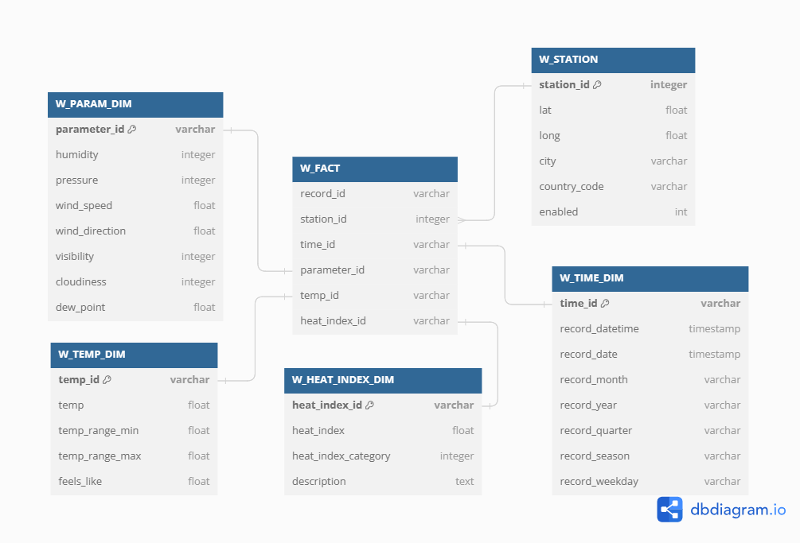

# WeatherFlow

An AirFlow project to gather weather information of various cities across Canada from [OpenWeatherMap](https://openweathermap.org/api) API

## Setup

### AirFlow
1. Create a virtual environment, activate environment
2. Install requirements.txt
3. Run `airflow scheduler` in a new terminal from project directory
4. Run `airflow webserver` in another terminal from project directory
5. Open localhost:8080 in browser
6. Go to Admin -> Variables and add values for API_KEY1, API_KEY2, MYSQL_DB, MYSQL_HOST, MYSQL_USER, MYSQL_PSWD
7. Enable DAG from DAGs menu

### Database (MySQL)

1. Install MySQL community server
2. Create a user or use Admin user
3. Create tables by running [SQL/create_tables.sql](./SQL/create_tables.sql)
4. Insert few records in W_STATION by running [SQL/insert_stations.sql](./SQL/insert_stations.sql)

## Database Schema

This project follows star schema in a data warehouse setting

